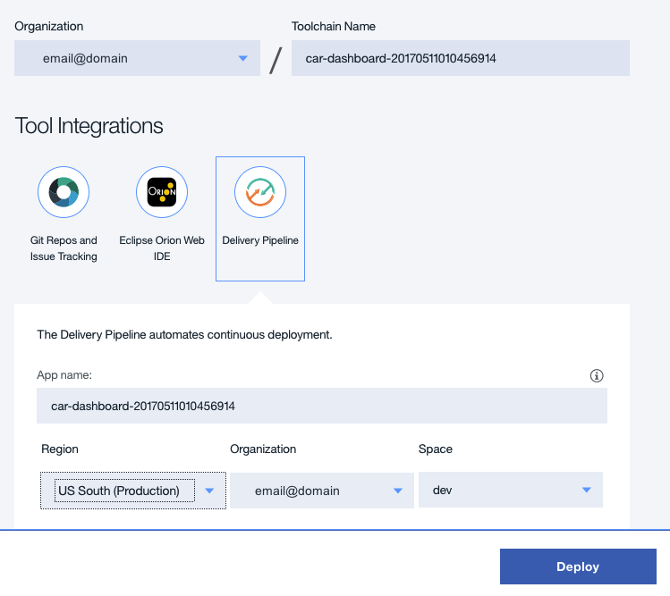
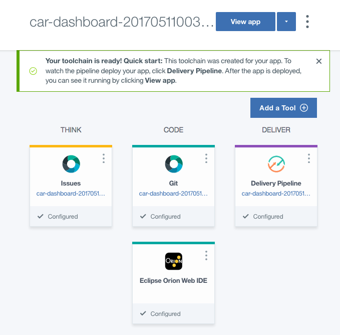
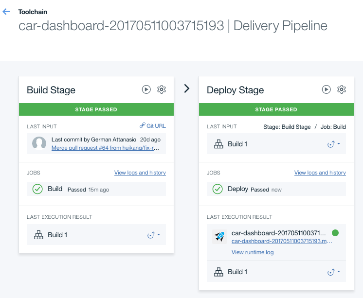
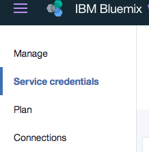
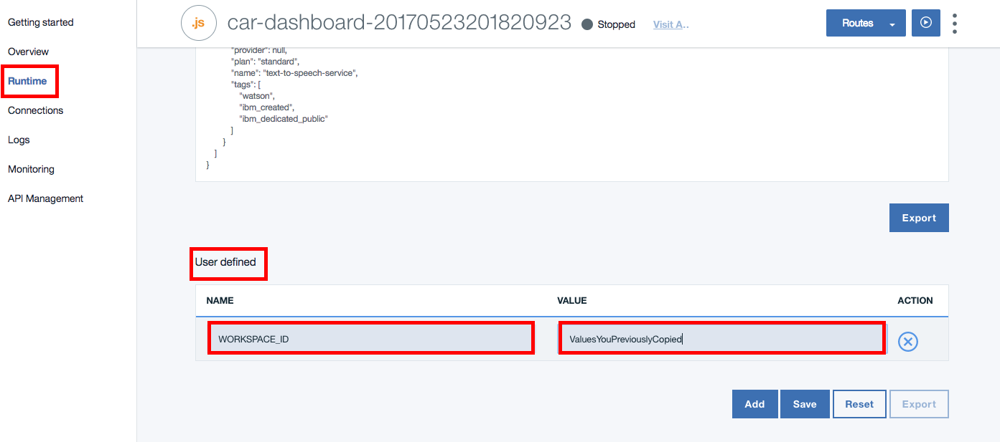

# Conversation Car Dashboard Demo Application
[](http://travis-ci.org/watson-developer-cloud/car-dashboard)
[](https://codecov.io/github/watson-developer-cloud/car-dashboard?branch=master)


This application demonstrates how the Conversation service uses intent capabilities in an animated car dashboard UI.

For more information about Conversation, see the [detailed documentation](https://console.bluemix.net/docs/services/conversation/index.html#about).

[See the demo](http://conversation-demo.mybluemix.net/).

&nbsp;&nbsp;&nbsp;&nbsp;&nbsp;&nbsp;&nbsp;&nbsp;&nbsp;&nbsp;&nbsp;&nbsp;&nbsp;&nbsp;&nbsp;&nbsp;&nbsp;&nbsp;&nbsp;&nbsp;&nbsp;&nbsp;&nbsp;&nbsp;&nbsp;&nbsp;&nbsp;&nbsp;&nbsp;&nbsp;&nbsp;&nbsp;&nbsp;&nbsp;&nbsp;&nbsp;[](#bluemix)     &nbsp;&nbsp;&nbsp;&nbsp;&nbsp;&nbsp;&nbsp;&nbsp;&nbsp;&nbsp;&nbsp;&nbsp;&nbsp;&nbsp;&nbsp;&nbsp;&nbsp;&nbsp;&nbsp;&nbsp;&nbsp;&nbsp;&nbsp;&nbsp;[](#local)

## How the app works
The app interface is designed and trained for chatting with a cognitive car. The interface allows the user to enter input either
using text, in the edit field at the bottom of the UI or via speech via by pressing the mic button.
Your questions and commands are run against a
small set of sample data trained with intents like these:

* `turn_on`
* `weather`
* `capabilities`

These intents help the system to understand variations of questions and commands that you might submit.
For example, if you say *"Wipers on"* or *"I want to turn on the windshield wipers"*, the system
understands that in both cases your intent is the same and responds accordingly.

# <a name="bluemix"></a> Getting Started using Bluemix


## Before you begin
1 Ensure that you have a [Bluemix account](https://console.ng.bluemix.net/registration/).

2 Ensure that you have the necessary space available in your Bluemix account. This action deploys 1 application and 3 services.
   * You can view this on your Bluemix Dashboard. Tiles will show what space you have available.
   * For example, for Services & APIS
   
   
&nbsp;&nbsp;&nbsp;&nbsp;&nbsp;&nbsp;&nbsp;&nbsp;&nbsp;&nbsp;&nbsp;&nbsp;

## Deploy the App
1 Click this button to Deploy to Bluemix.

&nbsp;&nbsp;&nbsp;&nbsp;&nbsp;&nbsp;&nbsp;&nbsp;&nbsp;&nbsp;&nbsp;&nbsp; [](https://bluemix.net/deploy?repository=https://github.com/watson-developer-cloud/car-dashboard)

2 Log in with an existing Bluemix account or sign up.

3 Select your Organization, Toolchain Name, Region, and Space, then click the`Deploy`buton.

&nbsp;&nbsp;&nbsp;&nbsp;&nbsp;&nbsp;&nbsp;&nbsp;&nbsp;&nbsp;&nbsp;&nbsp;

* This performs multiple actions:
  - Creates the app
  - Creates a Conversation service instance that the user needs for workspace creation
  - Creates instances for a Speech To Text service and Text To Speech service

* Your`car-dashboard`app is ready now, click`Delevery Pipeline`to deploy your app.

&nbsp;&nbsp;&nbsp;&nbsp;&nbsp;&nbsp;&nbsp;&nbsp;&nbsp;&nbsp;&nbsp;&nbsp;

5 Once your app has been built and deployed, navagate to your Bluemix Dashboard and [import a workspace](#workspace).

&nbsp;&nbsp;&nbsp;&nbsp;&nbsp;&nbsp;&nbsp;&nbsp;&nbsp;&nbsp;&nbsp;&nbsp;

## <a name="usingCloudfoundry"></a> Using Cloudfoundry CLI tool to deploy your application

To build the application:

1 Download and install the [Cloudfoundry CLI](https://github.com/cloudfoundry/cli) tool.

2 Git clone the project `https://github.com/watson-developer-cloud/car-dashboard`

3 Navigate to the `car-dashboard` folder

4 Connect to Bluemix in the command-line tool:

 For US Region

 ```sh

 $ cf api https://api.ng.bluemix.net

 ```

 ```sh

 $ cf login -u <your user ID>

 ```

5 Create the Conversation service in Bluemix:

 ```sh

 $ cf create-service conversation free conversation-service

 ```

6 Push it live:

 ```sh

 $ cf push <application-name>

 ```
 The name you use determinates your application URL initially, such as `<application-name>.mybluemix.net`.

# <a name="local"></a> Getting Started locally

## Before you begin

1 Ensure that you have a [Bluemix account](https://console.ng.bluemix.net/registration/). While you can do part of this deployment locally, you must still use Bluemix.

2 In Bluemix, [create a Conversation Service](https://console.bluemix.net/docs/services/conversation/getting-started.html#gettingstarted).
- Copy the Service Credentials for later use.
- [Import a workspace](#workspace)

3 **OPTIONAL**: If you want to use **Text To Speech** and/or **Speech To Text** in your locally runnning app, create a `text-to-speech` service and/or a `speech-to-text` service like you did in step 2.
- Copy the Service Credentials for later use.

## Running locally

  The application uses [Node.js](http://nodejs.org/) and [npm](https://www.npmjs.com/).

1 Copy the credentials from your `conversation-service` service in Bluemix to a `.env` file in the root.
- Look at `.env.example` as an example to create your `.env` file.

2 **OPTIONAL**: If you want to use Text To Speech and/or Speech To Text in your locally runnning app, copy the credentials from your `text-to-speech` service and/or `speech-to-text` service in Bluemix to a `.env` file in the root.
- Look at `.env.example` as an example to add to your `.env` file.

3 Use the Conversation tooling app to create a workspace, as described above, and add the workspace ID environment variable to the `.env` file. For details about obtaining the workspace ID, see Step 6 - 7 in the next section.

4 Install [Node.js](http://nodejs.org/).

5 Open the terminal, go to the project folder, and run this command:
```sh

npm install

```

6  Build the UI by running this command:
```sh

npm run build

```

7  Start the application by running this command:
```sh

npm start

```

8 Open `http://localhost:3000` in a browser.

_Note: If you are interested in deploying you local application or the changes you have made locally to Bluemix, go to [this section](#usingCloudfoundry)_

# <a name="workspace"></a> Import a workspace

1 You need to import the app's workspace. To do that, go to the Bluemix Dashboard and select the Conversation service instance. Once there, select the **Service Credentials** menu item.

&nbsp;&nbsp;&nbsp;&nbsp;&nbsp;&nbsp;&nbsp;&nbsp;&nbsp;&nbsp;&nbsp;&nbsp;

2 Select **ADD CREDENTIALS**. Name your credentials then select **ADD**.

3 Return to the **Manage** menu item and select **Launch Tooling**. This opens a new tab in your browser, where you are prompted to login if you have not done so before. Use your Bluemix credentials.

4 Download the [exported JSON file](https://raw.githubusercontent.com/watson-developer-cloud/conversation-simple/master/training/car_workspace.json) that contains the Workspace contents.

5 Select **Import**. Browse to (or drag and drop) the JSON file that you downloaded in Step 4. Choose to import **Everything(Intents, Entities, and Dialog)**. Then select **Import** to finish importing the workspace.

6 Refresh your browser. A new workspace tile is created within the tooling. Select the _menu_ button within the workspace tile, then select **View details**:

&nbsp;&nbsp;&nbsp;&nbsp;&nbsp;&nbsp;&nbsp;&nbsp;&nbsp;&nbsp;&nbsp;&nbsp;

<a name="workspaceID">
In the Details UI, copy the 36 character UNID **ID** field. This is the **Workspace ID**.
</a>

&nbsp;&nbsp;&nbsp;&nbsp;&nbsp;&nbsp;&nbsp;&nbsp;&nbsp;&nbsp;&nbsp;&nbsp; 


7 Return to your application, either in your local dev environment, or in Bluemix. If running on Bluemix, you need to [add environment variables](#env).

For more information on workspaces, see the full  [Conversation service documentation](https://console.bluemix.net/docs/services/conversation/configure-workspace.html#configuring-a-conversation-workspace).

# <a name="env"></a> Adding environment variables in Bluemix

1 In Bluemix, open the application from the Dashboard. Select **RUNTIME** on the left side menu.

2 Select **ENVIRONMENT VARIABLES** and scroll down to **USER-DEFINED**.

3 Select **ADD**.

4 Add a variable with the name **WORKSPACE_ID**. For the value, paste in the Workspace ID you [copied earlier](#workspaceID). Select **SAVE**.

&nbsp;&nbsp;&nbsp;&nbsp;&nbsp;&nbsp;&nbsp;&nbsp;&nbsp;&nbsp;&nbsp;&nbsp;

5 Restart your application.


# Troubleshooting in Bluemix

#### In the Classic Experience:
- Log in to Bluemix, you'll be taken to the dashboard.
- Navigate to the the application you previously created.
- Select **Logs**.

&nbsp;&nbsp;&nbsp;&nbsp;&nbsp;&nbsp;&nbsp;&nbsp;&nbsp;&nbsp;&nbsp;&nbsp;

- If you want, filter the LOG TYPE by "APP".

&nbsp;&nbsp;&nbsp;&nbsp;&nbsp;&nbsp;&nbsp;&nbsp;&nbsp;&nbsp;&nbsp;&nbsp;

#### In the new Bluemix:
- Log in to Bluemix, you'll be taken to the dashboard.
- Select **Compute**

&nbsp;&nbsp;&nbsp;&nbsp;&nbsp;&nbsp;&nbsp;&nbsp;&nbsp;&nbsp;&nbsp;&nbsp;

- Select the application you previously created.
- Select **Logs**.

&nbsp;&nbsp;&nbsp;&nbsp;&nbsp;&nbsp;&nbsp;&nbsp;&nbsp;&nbsp;&nbsp;&nbsp;

- If you want, filter the Log Type by selecting the drop-down and selecting **Application(APP)**.

&nbsp;&nbsp;&nbsp;&nbsp;&nbsp;&nbsp;&nbsp;&nbsp;&nbsp;&nbsp;&nbsp;&nbsp;

### With CLI

```
$ cf logs < application-name > --recent
```

# License

  This sample code is licensed under Apache 2.0.
  Full license text is available in [LICENSE](LICENSE).

# Contributing

  See [CONTRIBUTING](CONTRIBUTING.md).


## Open Source @ IBM

  Find more open source projects on the
  [IBM Github Page](http://ibm.github.io/).
